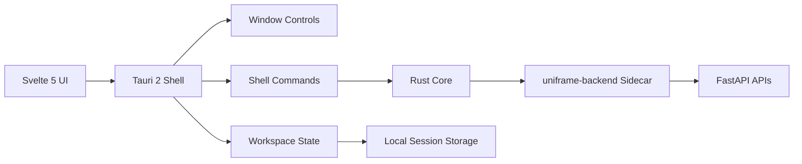

# UniFrame

> Modular desktop shell built with Svelte 5, Tauri 2 and FastAPI sidecars.


## Overview

UniFrame is a single-window desktop framework that hosts multiple internal modules inside a managed MDI workspace.
The shell owns window movement, resize, maximize, taskbar state, workspace restore, theme persistence and backend orchestration.

## Highlights

- `🪟 Custom desktop shell`: frameless Tauri window with native drag/maximize behavior.
- `🧩 Modular workspace`: each module opens inside `DraggableResizableWindow`.
- `⚙️ Shared state`: layout, focus order and theme are restored across sessions.
- `🚀 Embedded backend`: FastAPI is packaged as a Tauri sidecar named `uniframe-backend`.
- `🏗️ One-command release`: `build.py` syncs versions, builds the sidecar and produces the NSIS installer.

## Architecture



## Workspace Map

| Area | Responsibility | Key Files |
| --- | --- | --- |
| `Frontend` | Shell UI, taskbar, module windows, settings | `frontend/src/components`, `frontend/src/modules` |
| `Rust / Tauri` | Sidecar lifecycle, config persistence, native shell bridge | `src-tauri/src/main.rs` |
| `Backend` | Auth demo API, system context, health checks | `backend/main.py` |
| `Build` | Version sync, PyInstaller packaging, NSIS build flow | `build.py`, `version-settings.json` |

## Modules

| Icon | Module | Purpose | Integration |
| --- | --- | --- | --- |
| `AU` | `Authentication Console` | Local identity verification sample | `POST /api/auth/login` |
| `WS` | `Workspace Settings` | Theme, workspace reset and persistent shell preferences | Tauri `invoke` commands |
| `FW` | `Framework Blueprint` | Template surface for future subsystems | Shared UI contract |

## Prerequisites

- `Node.js`
- `Python 3.13+`
- `Rust toolchain`
- `git`
- `git-lfs`
- Windows environment with Tauri desktop build dependencies

## Development

### Install dependencies

```powershell
npm install
python -m venv backend\.venv
backend\.venv\Scripts\Activate.ps1
pip install -r backend\requirements.txt
```

### Run the desktop shell

```powershell
python run.py
```

`run.py` performs the full local development bootstrap:

- starts the FastAPI backend on `127.0.0.1:8000`
- waits for `GET /api/health`
- launches `npm run tauri:dev`
- terminates the backend when the Tauri process exits

### Manual commands

```powershell
# Frontend only
npm run dev

# Backend only
backend\.venv\Scripts\python.exe -m uvicorn backend.main:app --host 127.0.0.1 --port 8000

# Tauri production build only
npm run tauri:build
```

## Version Settings

Build versioning is controlled from the repo root:

```json
{
  "version": "0.1.0"
}
```

`build.py` reads `version-settings.json` and synchronizes the same version into:

- `package.json`
- `package-lock.json`
- `src-tauri/tauri.conf.json`
- `src-tauri/Cargo.toml`
- `backend/version.py`

You can also override the version during the build:

```powershell
python build.py --version 0.2.0
```

The override is persisted back into `version-settings.json` before packaging starts.

## Release Build

```powershell
python build.py
```

Release pipeline summary:

1. validates required tooling
2. resolves the build version and syncs all manifests
3. installs frontend and backend dependencies
4. packages FastAPI as `uniframe-backend.exe`
5. copies the sidecar into `src-tauri/binaries/uniframe-backend-<target>.exe`
6. runs the Tauri NSIS bundle build
7. copies the generated installer into `releases/`
8. tracks installers with Git LFS
9. commits and pushes the result to `main`

## Sidecar Packaging

The backend is packaged as a Tauri sidecar with the canonical name `uniframe-backend`.

| Layer | Value |
| --- | --- |
| PyInstaller output | `build/sidecar/uniframe-backend.exe` |
| Tauri binary registration | `src-tauri/binaries/uniframe-backend-<target>.exe` |
| Tauri config entry | `binaries/uniframe-backend` |
| Rust spawn name | `uniframe-backend` |

This keeps packaging, permissions and runtime spawn behavior aligned.

## Project Structure

```text
UniFrame/
|-- backend/
|   |-- __init__.py
|   |-- main.py
|   |-- requirements.txt
|   |-- sidecar_main.py
|   `-- version.py
|-- frontend/
|   |-- public/
|   `-- src/
|       |-- components/
|       |-- lib/
|       `-- modules/
|-- src-tauri/
|   |-- binaries/
|   |-- capabilities/
|   |-- icons/
|   |-- src/
|   |-- Cargo.toml
|   `-- tauri.conf.json
|-- build.py
|-- run.py
|-- uniframe-backend.spec
|-- version-settings.json
`-- README.md
```

## Runtime Notes

- Development mode starts the backend from Python directly.
- Production mode starts the packaged sidecar through Tauri Shell.
- Closing the Tauri window terminates the backend child process.
- Theme preference and workspace session are persisted through Tauri-managed local config files.

## Repository

- GitHub: [mucahitfezabektas/FLEXBOX](https://github.com/mucahitfezabektas/FLEXBOX)
- Default desktop bundle target: `NSIS`
- Installer artifacts are stored under `releases/`
